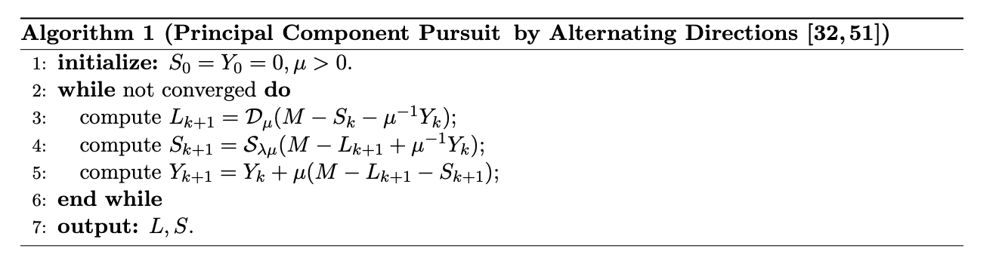

# Decomposition into Low-Rank and Sparse Matrices 
PCP was proposed and developed by Candes et al ( https://arxiv.org/pdf/0912. 3599.pdf ) via an alternating direction methods to solve RPCA problem:

*minimize*: ||L||∗ + ||S||1  
*subject to*: L + S = M

where ||L||∗ - is a nuclear norm, ||S||1 - is a L1-norm.

This approach gives good results for recovering low-rank and the sparse matrices in a background (low rank subspace) and foreground (sparse matrix - outliers) separation. But there are some disadvantages of this algorithm:

• PCP is a very computationally expensive

• PCP is a batch method (stack training frames in the input), so PCP is inappropriate for real-time subtraction (not incremental way, which would be more useful)

• PCP imposed the low-rank component being exactly low-rank and sparse component being exactly sparse but the observations such as in video surveillance are ofter corrupted by noise affecting every entry of the data matrix A lot of people are working on different variations of improved algorithms of PCP - incremental algorithms for updating L and S , real-time implementation. Available methods: Modified PCP with Partial Subspace Knowledge, Inductive PCP, PCP with Free Nuclear Norm and so on.

## We implemented Principal Component Pursuit by Alternating Directions with following algorithm:

### Results

### Dataset
Carnegie Mellon Test Images Sequences 500frames=25seconds (Y. Sheikh,Robotics  Institute,  Canergie  Mellon  University,  USA)  (1  video,  GT  images  for  the  se-quence)
http://www.cs.cmu.edu/~yaser/new_backgroundsubtraction.htm

